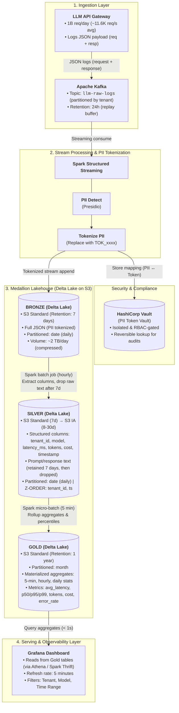

# Architecture: LLM Observability Platform — 1B Requests/Day

## 1. Problem Statement

Một foundation-model API team cần hệ thống observability cho **1 tỉ request/ngày**, mỗi request ~5 KB → **5 TB/ngày raw**. Yêu cầu:

- **Dashboard** cost & latency theo tenant, refresh **mỗi 5 phút**
- **Full prompt/response** giữ **7 ngày** cho incident review, sau đó chỉ giữ aggregates **1 năm**
- **PII redact** trước khi bất kỳ ai đọc dữ liệu
- Tổng chi phí storage **≤ $5K/tháng**

Khó vì: volume cực lớn (5 TB/ngày) kết hợp với yêu cầu near-real-time (5 phút), PII compliance bắt buộc ngay tại ingestion, và hard budget cap buộc phải tối ưu lifecycle nghiêm ngặt.

---

## 2. Architecture Diagram



---

## 3. Quyết Định Chính (với Alternatives Đã Loại)

### QĐ1: Table Format - Delta Lake

**Chọn: Delta Lake.**

- **Loại Apache Iceberg**: streaming ingestion với structured streaming trên Iceberg kém mature hơn Delta (cần Flink hoặc custom writer). Delta có native OPTIMIZE + Z-ORDER. Topic này append-heavy và cần MERGE cho dedup late events, nên Delta xử lý tốt hơn. Iceberg mạnh ở multi-engine nhưng ở đây chỉ dùng Spark, không cần.
- **Loại Apache Hudi**: Hudi thiết kế cho upsert-heavy workload (CDC), trong khi workload này 99% append. Hudi overhead cho copy-on-write/merge-on-read không cần thiết. Community nhỏ hơn, ít tooling.

### QĐ2: Streaming Engine - Spark Structured Streaming

**Chọn: Spark Structured Streaming (micro-batch mode).**

- **Loại Apache Flink**: Flink true-streaming (per-event) cho latency <1s, nhưng dashboard chỉ cần 5 phút refresh — micro-batch đủ dư. Flink vận hành phức tạp hơn (riêng cluster, state management), phải cần thêm người để maintain thêm một hệ thống nữa. Spark đã dùng cho batch transform Silver sang Gold, dùng luôn cho streaming giảm gánh nặng vận hành.
- **Loại Kafka Streams**: lightweight nhưng không có native Delta writer, phải custom. Không có distributed shuffle nên khó aggregate phức tạp (percentile tính toán). Không scale horizontally dễ như Spark.

### QĐ3: Partitioning + Clustering Strategy

**Chọn: Partition by `date` (daily) + Z-ORDER by (`tenant_id`, `timestamp`).**

- **Loại partition by `tenant_id`**: nếu có 10K+ tenants -> 10K directories/ngày -> gây vấn dề small file nghiêm trọng. File listing chậm, metadata overhead cao, optimize tốn kém.
- **Loại partition by `hour`**: 24 partitions/ngày x 365 ngày = 8,760 partitions -> gây metadata bloat. Daily partition + Z-ORDER trên timestamp cho hiệu quả tương đương với ít partition hơn.
- **Loại Liquid Clustering**: mới, chỉ available trên Databricks runtime - nếu sau này muốn migrate sang open-source Spark hoặc engine khác sẽ bị lock-in. Z-ORDER đã đủ cho pattern query cố định (filter tenant + time range). Liquid clustering phù hợp hơn khi query patterns thay đổi thường xuyên.

### QĐ4: PII Handling - Tokenization tại Bronze

**Chọn: Tokenization với external vault (HashiCorp Vault), thực hiện trong streaming pipeline trước khi ghi Bronze.**

- **Loại AES encryption**: nếu encryption key bị lộ, toàn bộ PII exposed. Tokenization với vault nghĩa là token vô nghĩa nếu không có vault access - vault có riêng ACL, audit log, key rotation. Defense-in-depth tốt hơn.
- **Loại masking (thay bằng `***`)**: mất dữ liệu vĩnh viễn. Khi incident review cần xem PII thật (authorized personnel), masking không đảo ngược được. Tokenization cho phép authorized lookup qua vault khi cần.
- **Loại defer PII redact tới Silver**: bất kỳ ai có S3 read access vào Bronze bucket sẽ thấy PII thô. Vi phạm principle of least privilege. Phải redact ngay tại điểm ingestion.

### QĐ5: Storage Tiering (FinOps)

**Chọn: S3 Standard (0–7 ngày) -> S3 IA (8–30 ngày cho metadata) -> DELETE.**
**Gold aggregates: S3 Standard (0–3 tháng) → S3 IA (3–12 tháng).**

- **Loại trường hợp giữ tất cả trên S3 Standard*: 14 TB Bronze × $0.023/GB = $322/tháng chỉ Bronze 7 ngày. Tuy fit budget nhưng lãng phí — dữ liệu Silver >7 ngày hiếm khi query, IA rẻ hơn 45%.
- **Loại Glacier cho Bronze cũ (thay vì DELETE)**: requirement nói rõ chỉ giữ raw 7 ngày. Glacier thêm cost và complexity (restore time 1-12h) cho data mà business đã nói không cần. Nếu cần replay, Kafka giữ 24h là đủ cho recent failures.
- **Loại S3 Intelligent Tiering**: monitoring fee $0.0025/1K objects/tháng. Với hàng triệu Parquet files, monitoring fee cộng dồn đáng kể. Pattern truy cập ở đây predictable (7 ngày hot, sau đó không ai đọc) -> rule-based lifecycle rẻ và đơn giản hơn.

### QĐ6: Catalog - AWS Glue Data Catalog

**Chọn: AWS Glue Data Catalog.**

- **Loại Databricks Unity Catalog**: vendor lock-in vào Databricks ecosystem. Nếu sau này muốn query bằng Trino, Athena, hoặc migrate engine sẽ khó. UC cũng có cost riêng.
- **Loại Hive Metastore tự host**: phải maintain MySQL/PostgreSQL backend, availability là trách nhiệm của team. Glue serverless, không cần quản lý infra, integrate native với S3, Athena, Spark on EMR.
- **Loại Apache Polaris / Nessie**: overkill cho use case này (không cần branching, không cần Iceberg REST catalog). Glue đủ cho Delta table registration + schema management.

### QĐ7: Dashboard Layer - Grafana + Pre-aggregated Gold

**Chọn: Grafana đọc từ Gold tables (qua Athena hoặc Spark Thrift Server).**

- **Loại query trực tiếp Silver** vì: Silver table hàng tỉ row/ngày, dashboard query sẽ scan quá nhiều data → chậm và tốn compute. Pre-aggregate vào Gold cho query <1s.
- **Loại Druid/Pinot (OLAP engine)** vì: thêm một hệ thống nữa phải vận hành. Gold table chỉ vài triệu row (aggregate per tenant per 5-min window) - Athena/Spark Thrift đủ nhanh. Druid phù hợp hơn khi cần sub-second trên raw events, nhưng đã có Gold layer nên không cần.

---

## 4. Failure Modes

### FM1: Streaming pipeline lag - Gold stale quá 5 phút

**Kịch bản:** Spark Structured Streaming job bị OOM hoặc executor lost lúc 3h sáng. Gold table không được update, dashboard shows stale data.

**Detection:** Alert khi `max(gold.timestamp) < now() - 10 minutes`. Spark Streaming có `StreamingQueryListener` emit metrics → push vào CloudWatch/Prometheus → Grafana alert.

**Rollback / Recovery:** Spark Structured Streaming dùng **checkpoint** (WAL trên S3). Restart job từ last checkpoint - tự replay từ Kafka (retention 24h). Delta ACID đảm bảo partial writes không corrupt table. Nếu checkpoint corrupt: reset offset về `earliest` trên Kafka topic, replay 24h, Delta `MERGE` đảm bảo idempotency (dedup trên `request_id`).

### FM2: PII tokenization service (Vault) down - data leak risk

**Kịch bản:** HashiCorp Vault unreachable lúc 3h sáng. Pipeline không thể tokenize PII. Hai lựa chọn xấu: (a) ghi raw PII vào Bronze (vi phạm compliance), (b) drop events (mất data).

**Detection:** Vault health check mỗi 30s. Pipeline emit metric `pii_tokenization_failures`.

**Rollback:** Pipeline PHẢI chọn (b) - **drop/dead-letter, không bao giờ ghi PII thô**. Events bị drop ghi vào Kafka dead-letter topic (không chứa data, chỉ chứa offset references). Khi Vault recover, replay dead-letter topic để backfill. Delta **time travel** cho phép verify: `SELECT * FROM bronze VERSION AS OF <timestamp>` để audit rằng không có PII thô nào lọt vào trong window Vault bị down.

### FM3: Schema evolution - API thêm field mới, pipeline break

**Kịch bản:** LLM API team thêm field `reasoning_tokens` vào response JSON. Bronze append OK (schema merge), nhưng Silver transform job fail vì expect fixed schema.

**Detection:** Spark job fail với `AnalysisException: cannot resolve 'reasoning_tokens'`. Alert trên job failure.

**Rollback:** Delta Lake hỗ trợ **schema evolution** - Bronze table set `mergeSchema = true` để auto-add new columns. Silver transform job dùng `SELECT` explicit columns -> new field bị ignore, không fail. Khi team update transform logic để include new field: dùng `ALTER TABLE silver ADD COLUMN reasoning_tokens BIGINT`, backfill từ Bronze bằng `MERGE`. Delta **time travel** (`DESCRIBE HISTORY silver`) cho phép xem chính xác schema thay đổi khi nào.

### FM4: Late-arriving events phá vỡ Gold aggregates

**Kịch bản:** Một batch events đến muộn 2 giờ (network partition phía tenant). Gold 5-min aggregates cho window đó đã finalized.

**Detection:** Watermark tracking trong streaming job. Metric `late_events_count` vượt threshold → alert.

**Rollback:** Dùng Delta `MERGE` để update Gold aggregates cho affected windows:
```sql
MERGE INTO gold.tenant_5min_stats AS g
USING (SELECT ... FROM silver WHERE is_late = true) AS s
ON g.tenant_id = s.tenant_id AND g.window = s.window
WHEN MATCHED THEN UPDATE SET
  g.request_count = g.request_count + s.late_count,
  g.total_cost = g.total_cost + s.late_cost
  -- ... recalculate percentiles
```
**Time travel** để verify trước/sau correction: `SELECT * FROM gold VERSION AS OF <before_fix>`.

---

## 5. Ước Lượng Chi Phí (Back-of-Envelope)

### Giả định compression
- Raw JSON 5 KB/req -> Parquet + Zstd: ~2.5x compression -> **2 KB/req**
- 1B req/day × 2 KB = **2 TB/day** (Bronze, after compression)
- Silver structured (no prompt/response text): ~0.3 KB/req -> **300 GB/day**
- Silver với prompt/response (7 ngày): ~1.5 KB/req -> **1.5 TB/day**

### Storage costs

| Layer | Size | Tier | $/GB/mo | Monthly Cost |
|-------|------|------|---------|-------------|
| Bronze (7d) | 2 TB/d × 7d = **14 TB** | S3 Standard | $0.023 | **$322** |
| Silver full (7d) | 1.5 TB/d × 7d = **10.5 TB** | S3 Standard | $0.023 | **$241** |
| Silver metadata only (8-30d) | 300 GB/d × 23d = **6.9 TB** | S3 IA | $0.0125 | **$86** |
| Gold aggregates (12mo) | ~**50 GB** total | S3 Standard | $0.023 | **$1.15** |
| Kafka (24h buffer) | ~**2 TB** | EBS gp3 | $0.08 | **$160** |
| **Total Storage** | | | | **~$810/mo** |

### Compute costs (estimate)

| Component | Config | Monthly Cost |
|-----------|--------|-------------|
| Spark Streaming (ingestion + PII) | 3× r5.2xlarge spot (~$0.20/h) | **$432** |
| Spark Batch (Silver→Gold, hourly) | 2× r5.xlarge spot, 1h/run | **$150** |
| OPTIMIZE + Z-ORDER (daily) | 2× r5.2xlarge, 2h/run | **$240** |
| Athena queries (dashboard) | ~5 TB scanned/mo | **$25** |
| Vault (t3.medium HA pair) | 2 instances | **$60** |
| **Total Compute** | | **~$907/mo** |

### Tổng cộng

| Category | Monthly |
|----------|---------|
| Storage | $810 |
| Compute | $907 |
| **Grand Total** | **~$1,717/mo** |

**Nằm trong budget $5K/tháng, headroom ~$3.3K** cho growth hoặc burst.

Nếu volume tăng 3x (3B req/day): storage ~$2,430 + compute ~$2,500 ≈ **$4,930** — vẫn vừa budget. Đây là scaling ceiling trước khi cần re-architect.

---

## 6. MVP — Slice Một Tuần Đầu Tiên

**Scope MVP:** Chứng minh end-to-end pipeline hoạt động với 1 tenant, 1M req/day (1/1000 scale).

### Ngày 1-2: Ingestion
- Setup Kafka topic `llm-raw-logs` (3 partitions)
- Spark Structured Streaming job đọc Kafka → ghi Bronze Delta table trên S3
- PII tokenization: bắt đầu bằng regex-based (email, phone) — chưa cần Vault, dùng SHA-256 hash trước
- Validate: Bronze table có data, schema đúng

### Ngày 3-4: Transform + Aggregate
- Spark batch job: Bronze → Silver (extract structured columns, Z-ORDER)
- Spark micro-batch: Silver → Gold (5-min aggregates per tenant)
- Validate: Gold table query <1s cho 1 tenant

### Ngày 5: Dashboard + Lifecycle
- Grafana dashboard đọc Gold qua Athena
- S3 lifecycle rule: Bronze auto-delete sau 7 ngày
- Test: xóa data >7 ngày, verify Gold aggregates vẫn intact

### Ngày 6-7: Hardening
- Replay test: kill streaming job, restart từ checkpoint, verify no data loss
- Late event test: inject events với timestamp cũ 1h, verify Gold re-aggregation
- Document kết quả, gaps, và kế hoạch scale-up

**Mục tiêu:** Sau 1 tuần, có working pipeline end-to-end chạy ở small scale, chứng minh mọi layer (Bronze→Silver→Gold) và mọi mechanism quan trọng (PII tokenization, lifecycle, late events) hoạt động đúng. Scale-up là vấn đề configuration (thêm Kafka partitions, thêm Spark executors), không phải re-architecture.